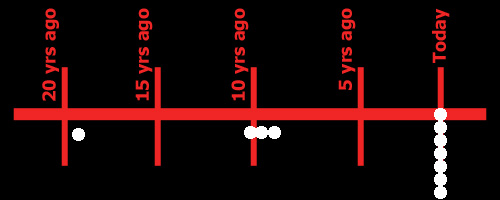

# Marvelous Bob
"An ordinary guy, extraordinary circumstances, and rising to the occasion."

My name is Michael Buonauro. I'm a professional writer. I can say that because you can't prove that I'm not.
Seriously though, I am a writer. I've written articles and I've been writing online comics for about four years and while my most well known work is in humor, I do write fiction. I feel that Marvelous Bob is the best example of my work and I like to think of it as a peek at my portfolio. If you like Marvelous Bob, you'll probably enjoy my other stories as well.

As for Bob, well, I had this idea in my head almost forever. I wanted a hero, but not the kind in a suit. Not the hero who fights for himself, but the hero who fights because he has to fight.

Bob isn't from another planet, he wasn't given powers by a blue midget. He's not carrying on a family legacy. He's just a guy, who lives his life, who does things as best he can, who happens to have more power than anyone could imagine.

I don't know how the story will end, and I'm not sure if it ever will. The original concept was supposed to be a lead in to another story, but along the way I just got wrapped up in Bob and his world. There are more characters than I know what to do with, and I'm thinking about writing an installment as a prequel.

While the postings right now are incomplete, Marvelous Bob is scheduled for completion in late May. I value whatever input you have to give, and I've posted on the web for pretty much that reason. Just don't steal it.

--Michael Buonauro

## Timeline
I have put together this timeline in order to help people get a feeling of when the flashbacks and current storyline are taking place. You really should read each section together and not jump around. I hope this helps you to see the progression of the character. If you have any questions, ask me.

